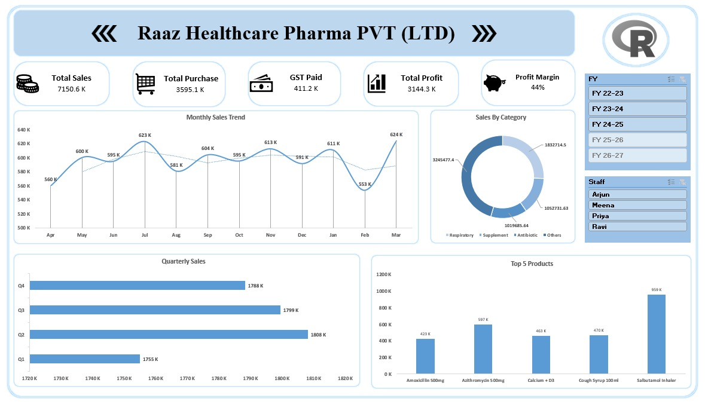
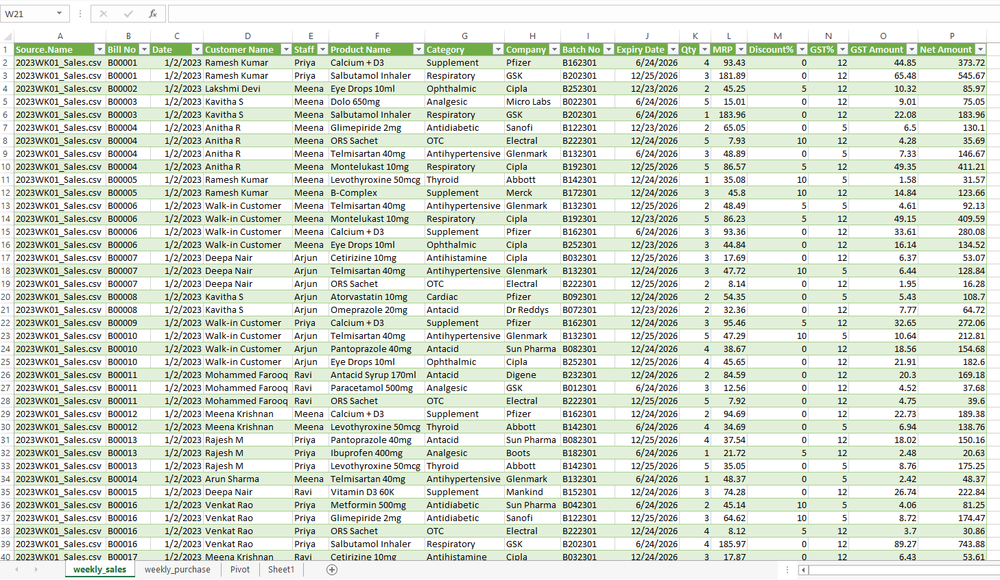
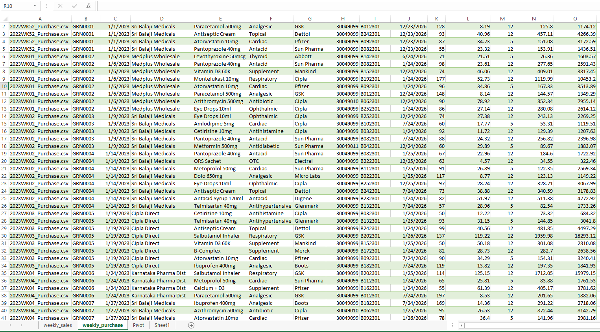

# 💊 Raaz Healthcare Pharma – Excel MIS Dashboard

<p align="center">
  <b>Interactive Executive Summary Dashboard built using Microsoft Excel, Power Query, Power Pivot, DAX, PivotTables and PivotCharts</b>
</p>

<p align="center">
  A practical Data Analytics & Business Intelligence portfolio project
</p>

---

## 📊 Dashboard Preview

<p align="center">
  
</p>

---

## 📌 Project Overview

The **Raaz Healthcare Pharma MIS Dashboard** is an interactive Excel-based management information system developed to analyze pharmacy sales, purchases, GST, profitability, product performance, and financial-year trends.

The project converts raw sales and purchase data into an easy-to-understand executive dashboard where important business KPIs and trends can be viewed from a single screen.

The dashboard follows an **April–March financial year** and includes interactive filters for financial year and staff.

---

## 🎯 Project Objectives

The main objectives of this project were to:

- Transform raw sales and purchase data into meaningful business information
- Build an interactive management dashboard in Microsoft Excel
- Create a structured data model using Power Pivot
- Apply DAX calculations for business KPIs
- Implement April–March financial-year reporting
- Analyze monthly and quarterly sales performance
- Measure purchases, GST, profit and profit margin
- Analyze revenue contribution by product category
- Identify top-performing products
- Enable dynamic filtering using Excel slicers
- Present management information in a clear single-screen dashboard

---

## 📊 Key Performance Indicators

The dashboard provides five major KPI cards.

| KPI | Purpose |
|---|---|
| 💰 **Total Sales** | Displays total sales revenue |
| 🛒 **Total Purchase** | Displays total purchase value |
| 💵 **GST Paid** | Tracks GST associated with business transactions |
| 📈 **Total Profit** | Measures overall gross profitability |
| 🐷 **Profit Margin** | Shows gross profit as a percentage of sales |

These KPI cards dynamically change according to the selected dashboard filters.

---

# 📈 Dashboard Visualizations

## 1️⃣ Monthly Sales Trend

The **Monthly Sales Trend** line chart displays sales performance across the selected financial year.

The months are arranged according to the Indian financial-year structure:

**Apr → May → Jun → Jul → Aug → Sep → Oct → Nov → Dec → Jan → Feb → Mar**

This makes it easier to identify:

- Monthly sales fluctuations
- High-performing months
- Lower-performing months
- Overall sales patterns throughout the financial year

---

## 2️⃣ Sales by Category

The **Sales by Category** donut chart shows the contribution of different product categories to overall sales.

The dashboard includes categories such as:

- Respiratory
- Supplement
- Antibiotic
- Others

This visualization helps identify which product categories contribute the most to business revenue.

---

## 3️⃣ Quarterly Sales

The **Quarterly Sales** chart compares total sales across the four financial quarters.

| Quarter | Months |
|---|---|
| **Q1** | April – June |
| **Q2** | July – September |
| **Q3** | October – December |
| **Q4** | January – March |

This provides a quick comparison of sales performance between different periods of the financial year.

---

## 4️⃣ Top 5 Products

The **Top 5 Products** chart identifies products generating the highest sales.

This visualization helps users quickly identify:

- Best-performing products
- Products generating the highest revenue
- Differences in sales performance between leading products

---

# 🎛️ Interactive Dashboard Filters

The dashboard includes interactive Excel slicers that allow the user to analyze the data dynamically.

## 📅 Financial Year

The dashboard supports financial-year filtering such as:

- FY 22-23
- FY 23-24
- FY 24-25
- FY 25-26
- FY 26-27

The reporting period follows:

**April → March**

---

## 👥 Staff

The dashboard also allows performance to be filtered by staff member.

Users can analyze:

- Individual staff performance
- Multiple selected staff members
- Consolidated business performance

When a filter is selected, the connected dashboard KPIs and charts update accordingly.

---

# 🗓️ Financial Year Logic

A dedicated calendar table was used to support financial-year reporting.

Unlike a standard calendar year beginning in January, this project uses an **April–March financial year**.

| Month | Financial Month No. | Quarter |
|---|---:|---|
| April | 1 | Q1 |
| May | 2 | Q1 |
| June | 3 | Q1 |
| July | 4 | Q2 |
| August | 5 | Q2 |
| September | 6 | Q2 |
| October | 7 | Q3 |
| November | 8 | Q3 |
| December | 9 | Q3 |
| January | 10 | Q4 |
| February | 11 | Q4 |
| March | 12 | Q4 |

This ensures that dashboard visuals follow the correct financial-year sequence rather than the standard January–December order.

---

# 🧮 Data Modelling & Calculations

The project uses **Power Pivot and DAX** to support the dashboard calculations and financial-year structure.

Examples of the calculations and logic used include:

- Financial month numbering
- Financial quarter classification
- Financial-year grouping
- Total sales calculation
- Total purchase calculation
- GST calculation
- Gross profit calculation
- Profit margin calculation
- Category-level sales analysis
- Product-level sales analysis
- Top product identification

---

# 🔄 Project Development Workflow

The overall project workflow followed this structure:

```text
Raw Sales & Purchase Data
          │
          ▼
    Data Extraction
          │
          ▼
      Power Query
          │
          ▼
 Data Cleaning & Preparation
          │
          ▼
      Power Pivot
          │
          ▼
     Data Modelling
          │
          ▼
 Calendar & Financial Year Logic
          │
          ▼
    DAX Calculations
          │
          ▼
      PivotTables
          │
          ▼
      PivotCharts
          │
          ▼
 KPI Cards & Dashboard Layout
          │
          ▼
      Excel Slicers
          │
          ▼
 Interactive MIS Dashboard
```

---

# 📂 Source Data

The project uses sales and purchase datasets as the main data sources.

## 🛒 Weekly Sales Data

<p align="center">
  
</p>

The sales dataset provides the transactional information required for sales, product, category and revenue analysis.

---

## 📦 Weekly Purchase Data

<p align="center">
  
</p>

The purchase dataset supports purchase-value, GST and profitability calculations used in the dashboard.

---

# 🛠️ Tools & Technologies

| Technology | Usage |
|---|---|
| **Microsoft Excel** | Dashboard development and analysis |
| **Power Query** | Data extraction, transformation and preparation |
| **Power Pivot** | Data modelling |
| **DAX** | Calculated columns and business calculations |
| **PivotTables** | Data summarization and analysis |
| **PivotCharts** | Dashboard visualizations |
| **Excel Slicers** | Interactive filtering |
| **GitHub** | Project documentation and portfolio presentation |

---

# 💡 Business Insights Available

The dashboard allows users to quickly analyze:

✔ Total sales performance  
✔ Total purchasing expenditure  
✔ GST values  
✔ Overall profitability  
✔ Profit margin  
✔ Monthly sales movements  
✔ Quarterly sales performance  
✔ Product-category contribution  
✔ Top-performing products  
✔ Staff-level performance  
✔ Financial-year performance  

The dashboard brings these metrics together into a single executive view.

---

# 🧠 Skills Practiced

This project helped me strengthen practical skills in:

### Data Preparation
- Data extraction
- Data cleaning
- Data transformation
- Structuring datasets

### Data Modelling
- Power Pivot
- Table relationships
- Calendar tables
- Financial-year modelling

### DAX & Analysis
- Calculated columns
- KPI calculations
- Financial month logic
- Quarter classification
- Profitability analysis

### Data Visualization
- KPI cards
- Line charts
- Donut charts
- Bar charts
- Column charts
- Interactive slicers
- Dashboard layout design

### Business Intelligence
- MIS reporting
- KPI analysis
- Sales analysis
- Purchase analysis
- Profitability analysis
- Product performance analysis

---

# 📁 Repository Structure

```text
Raaz_Healthcare_Pharma_PVT_-LTD-
│
├── 📊 Dashboard.jpeg
│   └── Final Excel MIS Dashboard preview
│
├── 📗 Pharmacy_Dashboard_V1.xlsx
│   └── Main interactive Excel dashboard workbook
│
├── 📈 Weekly_sales_data.png
│   └── Sales dataset preview
│
├── 📦 Weekly_purchase_data.png
│   └── Purchase dataset preview
│
├── 🗂️ Data.zip
│   └── Project data files
│
├── 🖼️ Mockup.jpeg
│   └── Dashboard design/mockup
│
└── 📄 README.md
    └── Project documentation
```

---

# 📥 Explore the Dashboard

The complete interactive Excel dashboard is available in:

### `Pharmacy_Dashboard_V1.xlsx`

Download the workbook from this repository to explore the:

- Interactive dashboard
- Financial-year filters
- Staff filters
- KPI calculations
- PivotTables
- PivotCharts
- Power Pivot model
- DAX calculations
- Underlying project data

---

# 📚 Learning Reference & Credits

This dashboard was developed as a **hands-on learning and portfolio project** by following the **Excel Dashboard Project tutorial by Variablz Academy and Parthiban Kannan**.

The tutorial provided guidance on the overall Excel dashboard development process, including:

- Data extraction using **Power Query Editor**
- Data modelling using **Power Pivot**
- Creating summaries using **PivotTables**
- Designing a dashboard layout
- Mapping KPI values
- Creating charts and visualizations
- Finalizing an interactive Excel dashboard

I followed these concepts and implemented them practically in the **Raaz Healthcare Pharma MIS Dashboard** to strengthen my understanding of Excel-based data analytics and business intelligence.

> **Credit:** The original tutorial, learning approach and supporting learning materials belong to **Variablz Academy and Parthiban Kannan**. This repository represents my implementation of the exercise as part of my learning and portfolio development.

---

# 👤 Project By

## Ahmed Raazim

**Data Analytics | Business Intelligence | Quality Assurance**

This project is part of my data analytics portfolio and demonstrates the practical skills I developed in:

`Excel` • `Power Query` • `Power Pivot` • `DAX` • `PivotTables` • `PivotCharts` • `Data Modelling` • `Data Visualization` • `Dashboard Development` • `MIS Reporting`

The purpose of publishing this project is to demonstrate my practical learning, analytical approach, and ability to transform raw business data into an interactive management dashboard.

---

<p align="center">
  <b>💊 Raaz Healthcare Pharma – Excel MIS Dashboard</b>
</p>

<p align="center">
  Built for learning, analysis and portfolio development.
</p>

<p align="center">
  ⭐ If you find this project useful, feel free to star the repository.
</p>
